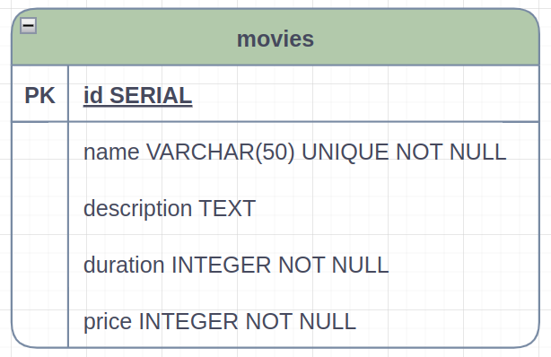

# m4-t14-movies-typeorm

Para essa entrega, é necessário executar testes automatizados.

# Documentação da API

## Tabela de Conteúdos

- [Visão Geral](#1-visão-geral)
- [Diagrama ER](#2-diagrama-er)
- [Início Rápido](#3-início-rápido)
  - [Instalando Dependências](#31-instalando-dependências)
  - [Variáveis de Ambiente](#32-variáveis-de-ambiente)
  - [Migrations](#33-migrations)
- [Endpoints](#4-endpoints)

---

## 1. Visão Geral

A aplicação trata-se de uma API contendo um CRUD para uma aplicação de filmes. Tecnologias utilizadas:

- [TypeScript](https://www.typescriptlang.org/)
- [NodeJS](https://nodejs.org/en/)
- [PostgreSQL](https://www.postgresql.org/)
- [Express](https://expressjs.com/pt-br/)
- [TypeORM](https://typeorm.io/)
- [Zod](https://zod.dev/)
- [Dotenv](https://www.npmjs.com/package/dotenv)

A URL base da aplicação:
http://localhost:3000

---

## 2. Diagrama ER

[ Voltar para o topo ](#tabela-de-conteúdos)

Diagrama de Entidade e Relacionamentos da API definindo bem as relações entre as tabelas do banco de dados.



---

## 3. Início Rápido

[ Voltar para o topo ](#tabela-de-conteúdos)

### 3.1. Instalando Dependências

Clone o projeto em sua máquina e instale as dependências com o comando:

```shell
yarn
```

### 3.2. Variáveis de Ambiente

Em seguida, crie um arquivo **.env**, copiando o formato do arquivo **.env.example**:

```
cp .env.example .env
```

Configure suas variáveis de ambiente com suas credenciais do Postgres e uma nova database da sua escolha.

### 3.3. Migrations

Execute as migrations com o comando:

```
yarn typeorm migration:run -d src/data-source.ts
```

---

## 4. Endpoints

[ Voltar para o topo ](#tabela-de-conteúdos)

### Índice

- [Movies](#1-movies)
  - [POST - /movies](#11-criação-de-filme)
  - [GET - /movies](#12-listando-filmes)
  - [PATCH - /movies/:id](#13-editar-filme-por-id)
  - [DELETE - /movies/:id](#14-deletar-filme-por-id)

---

## 1. **Movies**

[ Voltar para os Endpoints ](#5-endpoints)

O objeto Movie é definido como:

| Campo       | Tipo    | Descrição                     |
| ----------- | ------- | ----------------------------- |
| id          | string  | Identificador único do filme. |
| name        | string  | Nome do filme.                |
| description | string  | Descrição do filme.           |
| duration    | integer | Duração do filme.             |
| price       | integer | Preço do filme.               |

### Endpoints

| Método | Rota        | Descrição                                       |
| ------ | ----------- | ----------------------------------------------- |
| POST   | /movies     | Criação de um filme.                            |
| GET    | /movies     | Lista todos os filmes.                          |
| PATCH  | /movies/:id | Atualiza um filme usando seu ID como parâmetro. |
| DELETE | /movies/:id | Deleta um filme usando seu ID como parâmetro.   |

---

### 1.1. **Criação de filme**

[ Voltar para os Endpoints ](#5-endpoints)

### `/movies`

### Exemplo de Request:

```
POST /movies
Host: http://localhost:3000/movies
Authorization: None
Content-type: application/json
```

### Corpo da Requisição:

```json
{
  "name": "Cidadão Kane",
  "description": null,
  "duration": 169,
  "price": 25
}
```

### Schema de Validação com Zod:

```javascript
name: z.string().min(3).max(50),
description: z.string().nullable().optional(),
duration: z.number().positive(),
price: z.number().int()
```

OBS.: Chaves não presentes no schema serão removidas.

### Exemplo de Response:

```
201 Created
```

```json
{
  "id": 1,
  "name": "Cidadão Kane",
  "description": null,
  "duration": 169,
  "price": 25
}
```

### Possíveis Erros:

| Código do Erro | Descrição             |
| -------------- | --------------------- |
| 409 Conflict   | Movie already exists. |

---

### 1.2. **Listando filmes**

[ Voltar aos Endpoints ](#5-endpoints)

### `/movies`

### Exemplo de Request:

```
GET /movies
Host: http://localhost:3000/movies
Authorization: None
Content-type: application/json
```

### Corpo da Requisição:

```json
Vazio
```

### Exemplo de Response:

```
200 OK
```

```json
{
  "prevPage": null,
  "nextPage": null,
  "count": 1,
  "data": [
    {
      "id": 1,
      "name": "Cidadão Kane",
      "description": null,
      "duration": 169,
      "price": 25
    }
  ]
}
```

### Possíveis Erros:

Nesta rota não há erros, somente poderá vir uma lista vazia caso não tenha nenhum filme cadastrado.

---

### 1.3. **Editar filme por id**

[ Voltar aos Endpoints ](#5-endpoints)

### `/movies/:id`

### Exemplo de Request:

```
PATCH /movies/:id
Host: http://localhost:3000/movies/1
Authorization: None
Content-type: application/json
```

### Parâmetros da Requisição:

| Parâmetro | Tipo   | Descrição                            |
| --------- | ------ | ------------------------------------ |
| id        | string | Identificador único do filme (Movie) |

### Corpo da Requisição:

```json
{
  "description": "A obra-prima de Orson Welles conta a história do magnata da imprensa Charles Foster Kane em uma sequência de flashbacks."
}
```

### Schema de Validação com Zod:

```javascript
name?: z.string().min(3).max(50),
description?: z.string().nullable().optional(),
duration?: z.number().positive(),
price?: z.number().int()
```

OBS.: Chaves não presentes no schema serão removidas.

### Exemplo de Response:

```
200 OK
```

```json
{
  "id": 1,
  "name": "Cidadão Kane",
  "description": "A obra-prima de Orson Welles conta a história do magnata da imprensa Charles Foster Kane em uma sequência de flashbacks.",
  "duration": 169,
  "price": 25
}
```

### Possíveis Erros:

| Código do Erro | Descrição             |
| -------------- | --------------------- |
| 404 Not Found  | Movie not found.      |
| 409 Conflict   | Movie already exists. |

### 1.4. **Deletar filme por id**

[ Voltar aos Endpoints ](#5-endpoints)

### `/movies/:id`

### Exemplo de Request:

```
DELETE /movies/:id
Host: http://localhost:3000/movies/1
Authorization: None
Content-type: application/json
```

### Parâmetros da Requisição:

| Parâmetro | Tipo   | Descrição                            |
| --------- | ------ | ------------------------------------ |
| id        | string | Identificador único do filme (Movie) |

### Corpo da Requisição:

```json
Vazio
```

### Exemplo de Response:

```
204 No Content
```

```json
Vazio
```

### Possíveis Erros:

| Código do Erro | Descrição        |
| -------------- | ---------------- |
| 404 Not Found  | Movie not found. |
